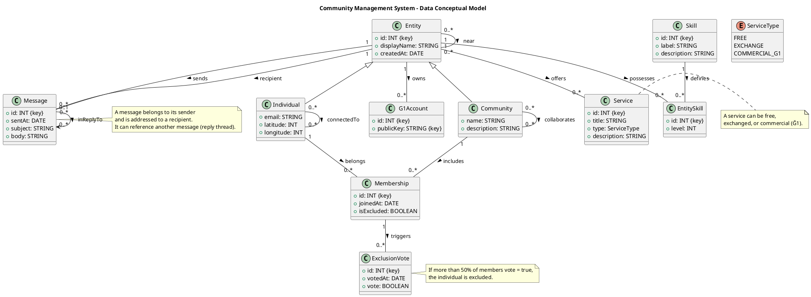

# 1️)Scope & Intent

This document presents the data model for a system designed to manage people and communities, along with their interactions such as memberships, messages, skills, services, links, and Ğ1 accounts.

A single `Entity` supertype is used so that all features (messaging, services, skills, and G1 accounts) can reference entities through the same foreign key.

## 2️) Entities, Identity & Inheritance

**Entity** (`id`, `displayName`, `createdAt`)  
Supertype for both `Person` and `Community`.  
**Person** (`id`, ...) → `id` is both PK and FK to `Entity(id)`  
**Community** (`id`, ...) → `id` is both PK and FK to `Entity(id)`

### Inheritance mapping:
- **Class-table inheritance** with shared primary key  
- **Disjointness:** Each `Entity` row is extended by either `Person` or `Community`, never both  
- **Totality:** There should be no “bare” `Entity` rows without a subtype  

## 3️) Memberships (Composition vs. Aggregation)

### UML semantics:
- `Community` — **composition →** `Membership`  
- `Person` — **aggregation →** `Membership`

### Relational mapping:
`Membership(personId, communityId, joinedAt, isExcluded)`  
**PK:** (`personId`, `communityId`)  
**FK** `communityId → Community(id)` ON DELETE CASCADE  
**FK** `personId → Person(id)` ON DELETE RESTRICT  

**Business rule:** Only one membership per person–community pair.

## 4️) Exclusion Votes & Decision Rule

`ExclusionVote(communityId, targetPersonId, voterPersonId, votedAt, vote)`  
A person is excluded if **more than 50%** of members vote `TRUE` (against presence).

## 5️) Links

Links between individuals and communities are represented as **self-associations**:

- `Individual` can be connected to other individuals (`connectedTo`)  
- `Community` can collaborate with other communities (`collaborates`)

These links are **unidirectional** and indicate a simple connection or collaboration relationship between entities.

## 6️) Skills on Any Entity

`Skill(id, label, description)`  
`EntitySkill(entityId, skillId, level[1..5], declaredAt)`  

Both communities and people can declare skills.

## 7️) Services

`Service(id, providerId, title, description, type, priceG1?, wantedServiceId?, createdAt)`  
A service can be **free, exchanged, or commercial (paid in Ğ1)**

## 8️) Ğ1 Accounts

`G1Account(publicKey UNIQUE, entityId, label?, createdAt)`  
Multiple accounts can be linked to a single entity.

## 9️) Messaging

`Message(id, senderId, recipientId, sentAt, subject?, body, inReplyToId?, ownerId)`  
A message belongs to its sender and can reference another message (reply threads).

## 10) Proximity View

Derived view showing entities located near each other (distance < 1 km).  
Calculated using the **Haversine formula** or a **PostGIS distance function**.

## 11️) Constraints

Integrity constraints ensure data quality:
- Unique community names  
- Valid latitude/longitude ranges  
- Level between 1 and 5 for skills  

## 12️) Security & Moderation

Basic rules:
- Only sender and recipient can read messages  
- Excluded members lose write access  
- Rate limits prevent spam  

****

This is our diagram : 

